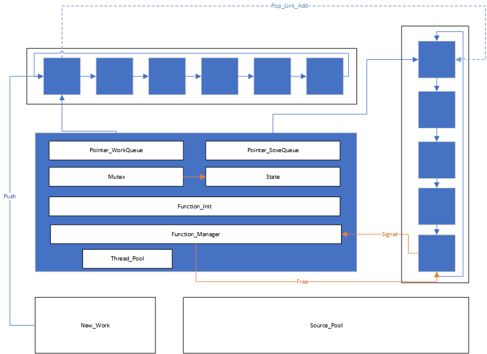

# 线程池的构建

线程池是一项管理多线程的技术，可以复用已创建的线程进行任务的处理，减少创建和销毁线程带来的开销。

线程池一般具有以下几个部分：任务队列、处理队列、线程池和拒绝策略。

任务队列维护一个由任务节点组成的队列，节点内存放链接其他节点的指针、需要处理的参数与选择处理的函数，当有任务需要进行多线程处理时，会将该任务的处理函数和参数放入队列中。任务队列需要拥有插入、调出节点的方法和检测容量、进行管理的方法。

工作队列维护一个描述当前空闲线程的队列，节点内需要存放线程相关信息、线程池信息和链接的任务节点的信息。

线程池中需要有任务队列和处理队列的地址信息，需要有一个互斥锁唯一确定线程池的状态，避免争抢资源，需要有条件等待的功能。

除此之外，需要有一个不断从线程池中访问任务队列，并从中取出任务节点连接工作队列，进行任务处理的方法：①锁线程池②当没有等待任务时进入条件等待状态③取出需要处理的任务节点并调用处理函数，放入到相应线程中④解锁

需要有一个用于管理线程池的方法：初始化（①为对应数量的工作线程开辟空间并加入到线程池中，创建对应数量的线程进行管理，线程开启并进入条件等待状态。）申请线程和回收线程（①锁②操作③发出信号④解锁）




## 线程池项目的解析

* 数据结构

    该项目中至少存在两种结构：任务节点和线程池。

    任务节点中存放一个接收一个void* 指针作为参数的**函数指针**表示执行的任务，一个void* 的指针指向实际参数的存放地址。

    ```c++
    //任务结构体
    typedef struct Task
    {
        /* data */
        Func function;
        //存放一个函数指针表示执行的任务
        void* arg;
        //存放一个指针指向向任务传递的参数
    
    }Task;
    
    ```

    线程池中应该存放有以下数据：

    * 任务**队列**：一个连续存储形式存放的任务节点的头节点（指向一个连续存储的容器）；

    * 描述任务队列的信息：包括容量、当前任务个数、队头部（Head用于取数据）和队尾部（Tail用于放数据）

    * 管理诸线程的**管理者**线程：单独运行的一个管理者，功能是对线程池进行管理。

    * 工作线程：线程池中管理的线程，具有busy和free两个状态，用于多线程处理任务。

    * 描述线程池的相关信息：最小线程数、最大线程数、正处于工作中的线程数（busy状态）、现有线程数（exist/now）、需要销毁的线程数（用于通过信号将条件等待状态的线程唤醒后进行自销毁操作的数据存放）

    * **互斥锁**：对于线程池资源的有序管理的锁、对于频繁应用的资源的锁（比如busy状态的线程数）。

    * **条件变量**：作为信号通知线程的变量。

        ```c++
        //线程池结构体
        typedef struct ThreadPool
        {
            /* data */
            Task* taskQueue;
            //任务队列
            int queueCapacity;  //容量
            int queueSize;      //当前任务个数
            int queueFront;     //队头-->取数据
            int queueRear;      //队尾-->放数据
        
            //
            pthread_t manangerID;   //管理者线程ID
            pthread_t *threadIDs;   //工作的线程ID
        
            //线程数量的配置信息
            int minNum;     //最小线程数
            int maxNum;     //最大线程数
            int busyNum;    //工作中线程数   --频繁变化的需要单独加锁
            int nowNum;     //现存活线程数
            int killNum;    //需要杀掉的线程数
        
            pthread_mutex_t mutexPool; //互斥锁整个的线程池--操作任务队列时队线程池的资源的访问
            pthread_mutex_t mutexBusy; //锁busy线程的资源
            pthread_cond_t notFull;     //判断任务队列是否满
            pthread_cond_t notEmpty;    //判断任务队列是否空
        
            int status; //线程池的状态
        }ThreadPool;
        ```

        

* 实现的功能

    一个线程池模块需要有的功能：

    * 创建线程线程池并初始化

        ①检查能否实例化内存池并分配内存。

        ②初始化线程池所管理的线程区域（一次性分配内存，随需要添加线程实例进去）（涉及到内存的初始化）

        ③对参数信息的初始化

        ④对锁和条件变量的初始化（mutex和condition）

        ⑤创建管理者线程并绑定管理策略（即创建时与该线程绑定被唤醒时执行的函数）

        ⑥创建初始工作线程并绑定工作策略（即创建时与该线程绑定被唤醒时执行的函数，在该函数内再进行具体的调用工作模块内的函数的操作。）

        对于分批分配内存（堆）的操作，操作异常时需要将已分配的内存进行释放再返回，可以使用do{}while(0)进行调控，同时注意**先判断其父作用域是否存在，再判断该作用域能否访问**。

        ```c++
        ThreadPool* CreateThreadPool(int queueSize,int minThreadCount,int maxThreadCount)
        {
            ThreadPool* pool =(ThreadPool*)malloc(sizeof(ThreadPool));
        
            do{
            if(!pool)
            {
                //线程池创建失败
                std::cout<<"malloc threadPool fail"<<std::endl;
                break;
            }
        
            //对线程池管理的线程进行初始化内存分配
            pool->threadIDs=(pthread_t*)malloc(sizeof(pthread_t)*maxThreadCount);
            if(!pool)
            {
                //线程创建失败
                std::cout<<"malloc threadIDs fail"<<std::endl;
                break;
            }
        
            memset(pool->threadIDs,0,sizeof(pthread_t)*maxThreadCount);
            //分配内存后进行内存的初始化
        
            pool->minNum=minThreadCount;
            pool->maxNum=maxThreadCount;
            pool->busyNum=0;
            pool->nowNum=minThreadCount;
            pool->killNum=0;
        
            if(pthread_mutex_init(&pool->mutexPool,NULL)!=0 ||
               pthread_mutex_init(&pool->mutexBusy,NULL)!=0 ||
               pthread_cond_init(&pool->notEmpty,NULL)!=0  ||
               pthread_cond_init(&pool->notFull,NULL)!=0)
               {
                std::cout<<"init fail"<<std::endl;
               break;
               }
        
            //任务队列初始化
            pool->taskQueue=(Task*)malloc(sizeof(Task)*queueSize);
            pool->queueCapacity=queueSize;
            pool->queueSize=0;
            pool->queueFront=0;
            pool->queueRear=0;
        
            pool->status=0;
        
            //创建线程
            //管理者线程
            pthread_create(&pool->manangerID,NULL,manager,pool);
            //工作线程的函数（manager）
            for(int i=0;i<minThreadCount;++i)
            {
                pthread_create(&pool->threadIDs[i],NULL,worker,pool);
        
            }
        
            return pool;
            }while (0);
        
            if(pool && pool->threadIDs) free(pool->threadIDs);
            if(pool && pool->taskQueue) free(pool->taskQueue);
            if(pool) free(pool);
            //先判断pool是否存在，再访问pool内部成员
            //出现异常，释放资源（适用于多出口且需要释放堆内存的情况）
            return NULL;
        
        }
        ```

        

    * 从任务队列中取出任务节点并执行节点内函数、执行完后将线程进入条件等待状态。

        这是工作线程绑定的策略方法，需要实现：

        ①检查任务队列是否为空&线程池是否可用、线程池的状态（是否需要销毁线程）

        ②对于不同状态执行不同的操作：进入条件等待、取任务并执行任务、销毁线程。

        ```c++
        void* worker(void* arg)
        {
            ThreadPool* pool =(ThreadPool*)arg;
            while(1)
            {
                //进入循环读取线程池资源
        
                pthread_mutex_lock(&pool->mutexPool);
                //printf("pool lock\n");
                //当前任务队列是否为空
                while(pool->queueSize==0 && !pool->status)
                {
                    //当前任务队列为空且线程池子可使用
                    //阻塞工作线程
                    pthread_cond_wait(&pool->notEmpty,&pool->mutexPool);
                    //进入一个条件等待状态，以pool->notEmpty的状态为监测对象，用于唤起pool->mutexPool线程。
                    
                    //被唤醒时执行的操作的控制：根据唤醒状态选择执行任务或销毁
                    if(pool->killNum>0)
                    {
                        pool->killNum--; //这是唤醒后的控制变量，无论如何都会递减，表示的是已经对这部分处理了。
                        if(pool->nowNum>pool->minNum)
                        {
                            pool->nowNum--;
                           // printf("pool unlock in wait to kill\n");
                            pthread_mutex_unlock(&pool->mutexPool);
                            threadExited(pool);
                        }
        
                    }
                }
        
                //判断线程池是否可使用
                if(pool->status)
                {
                  //  printf("pool unlock in pool destoried\n");
                    pthread_mutex_unlock(&pool->mutexPool);
                    threadExited(pool);
                }
        
                Task task;
                task.function = pool->taskQueue[pool->queueFront].function;
                task.arg=pool->taskQueue[pool->queueFront].arg;
                //读取之后列表节点向后移动
                //维护为一个循环队列
                pool->queueFront=(pool->queueFront+1)% pool->queueCapacity;
                pool->queueSize--;
                //取出了一个后，它不满了，唤醒生产者生产任务
                pthread_cond_signal(&pool->notFull);
                //printf("pool unlock\n");
                pthread_mutex_unlock(&pool->mutexPool);
        
        
                pthread_mutex_lock(&pool->mutexBusy);
               // printf("thread %ld start working... \n",pthread_self());
                pool->busyNum++;
                pthread_mutex_unlock(&pool->mutexBusy);
                task.function(task.arg);
                //在函数调用时，如果传入的是堆内存，在未释放前一直存在，如果传入的是栈内存，则可能在某函数调用后被释放。
                //传入的是堆内存，需要手动释放
                //std::cout<<"thread end working..."<<std::endl;
        
                free(task.arg);
                task.arg=NULL;
                //printf("thread %ld end working... \n",pthread_self());
                pthread_mutex_lock(&pool->mutexBusy);
                pool->busyNum--;
                pthread_mutex_unlock(&pool->mutexBusy);
        
            }
            return NULL;
        }
        ```

    * 定时监测线程池状态并进行调节（添加或销毁线程）。

        也就是管理者线程绑定的唤醒执行函数，需要实现以下功能：

        ①按一定频率对线程池进行状态监测

        ②根据状态信息选择合适的策略或算法进行资源调整（创建线程或销毁线程）

        ```c++
        void* manager(void* arg)
        {
            //在绑定时传入的参数为pool，所以转换为ThreadPool*
            ThreadPool* pool =(ThreadPool*)arg;
        
        //需要进入一个循环执行的过程，以一定频率对线程池进行调节。
            while(!pool->status)
            {
                    //每隔3s检测一次。
                    sleep(3);
                    //取出线程池中的任务的数量和当前线程数量
                    pthread_mutex_lock(&pool->mutexPool);
                    int queueSize=pool->queueSize;
                    int nowNum=pool->nowNum;
                    pthread_mutex_unlock(&pool->mutexPool);
        
                    //取出忙线程数量
                    pthread_mutex_lock(&pool->mutexBusy);
                    int busyNum=pool->busyNum;
                    pthread_mutex_unlock(&pool->mutexBusy);
        
        
                    //添加和销毁线程
                    //添加策略    --任务数>存在线程个数  && 存在线程个数<最大线程数
                    if(queueSize>nowNum && nowNum<pool->maxNum)
                    {
                        pthread_mutex_lock(&pool->mutexPool);
                        int count =0;
                        //访问了线程池
                        for(int i=0; i<pool->maxNum && count<ADDNUM &&pool->nowNum < pool->maxNum;++i)
                        {
                            if(pool->threadIDs[i]==0)  //线程未被使用时=0
                            {
                              pthread_create(&pool->threadIDs[i],NULL,worker,pool);
                              count++;
                              pool->nowNum++;
                            }
                           
                        }
                        pthread_mutex_unlock(&pool->mutexPool);
                    }
                     
                     //销毁策略  --忙线程远小于存活线程数 && 存活线程数>最小线程数
                    if(busyNum* 2 < nowNum && nowNum>pool->minNum)
                    {
                        pthread_mutex_lock(&pool->mutexPool);
                        pool->killNum =DELNUM;
                        pthread_mutex_unlock(&pool->mutexPool);
        
                        //让工作线程自杀
                        // --明确状态：空闲线程处于阻塞的条件等待状态  --策略：唤醒线程并不分配任务，直接结束线程。
                        for(int i=0;i<DELNUM;++i)
                        {
                            pthread_cond_signal(&pool->notEmpty);
                        }
        
                    }
        
            }
        
            return NULL;
        }
        ```

    * 线程销毁、线程添加。

        * 线程销毁使用的是线程函数的exit，但在此操作是需要对销毁的线程进行定位并**对内存进行初始化**。

            ```c++
            void threadExited(ThreadPool* pool)
            {
                pthread_t tid=pthread_self();
                for(int i=0;i<pool->maxNum;++i)
                {
                    printf("threadExited called %ld  ... now i=%d \n",tid,i);
                    if(pool->threadIDs[i]==tid)
                    {
                        pool->threadIDs[i]=0;
                        //std::cout<<"threadExited called,"<<tid<<" exiting"<<std::endl;
                        printf("threadExited called %ld  exiting\n",tid);
                        break;
                    }
                }
                pthread_exit(NULL);
            }
            ```

    * 任务添加

        需要做到的功能有：

        ①检查线程池状态，判断处理队列是否满、线程是否达管理上限。

        ②为线程池中的任务队列添加任务并进行配置。

        这里维护的是一个循环队列，所以采用取余法维护。

        ```c++
        
        void AddThreadToPool(ThreadPool* pool ,Func func,void* arg)
        {
            pthread_mutex_lock(&pool->mutexPool);
            //判断队列满
            while(pool->queueSize==pool->queueCapacity && !pool->status)
            {
                //阻塞生产者线程
                pthread_cond_wait(&pool->notFull,&pool->mutexPool);
            }
        
            if(pool->status)
            {
                pthread_mutex_unlock(&pool->mutexPool);
                return;
            }
        
            //添加任务
            pool->taskQueue[pool->queueRear].function=func;
            pool->taskQueue[pool->queueRear].arg=arg;
            pool->queueRear=(pool->queueRear+1)%pool->queueCapacity;
            pool->queueSize++;
        
            //唤醒工作线程取任务
            pthread_cond_signal(&pool->notEmpty);
        
        
            pthread_mutex_unlock(&pool->mutexPool);
        }
        
        ```

    * 线程池销毁。

        需要实现的功能：

        ①先判断线程池是否初始化，在安全的情况下执行相关操作。

        ②先改线程池状态，再阻塞回收管理者线程，然后对存活的线程进行回收

        ③对参数进行内存释放，对锁和条件变量进行销毁，最后再释放整个内存池。

        ```c++
        int DestroyThreadPool(ThreadPool* pool)
        {
            if(pool==NULL)
            {
                return -1;
            }
            //若指向有效地址，需要先关闭线程池
            pool->status=true;
            pthread_join(pool->manangerID,NULL);        //阻塞回收管理者线程  --阻塞等待管理者线程退出
            //唤醒阻塞的消费者线程（存活的线程）  --此时状态是线程池被销毁了 --所以被唤醒即被销毁
            for(int i=0;i<pool->nowNum;++i)
            {
                pthread_cond_signal(&pool->notEmpty);
            }
        
            //释放内存
            if(pool->taskQueue)
            {
                free(pool->taskQueue);
                //pool->taskQueue=NULL;
            }
            if(pool->threadIDs)
            {
                free(pool->threadIDs);
                //pool->threadIDs=NULL;
            }
            printf("NOW This complete!\n");
            pthread_mutex_destroy(&pool->mutexBusy);
            pthread_mutex_destroy(&pool->mutexPool);
            pthread_cond_destroy(&pool->notEmpty);
            pthread_cond_destroy(&pool->notFull);
        
            free(pool);
            pool=NULL;
        
            return 0;
        }
        ```

    * 头文件

        ```c++
        #ifndef _THREADPOOL_H
        #define _THREADPOOL_H
        
        using ThreadPool=struct ThreadPool;
        using Func=void(*)(void* arg);
        //创建线程池，初始化
        ThreadPool* CreateThreadPool(int queueSize,int minThreadCount,int maxThreadCount);
        
        //销毁线程池
        int DestroyThreadPool(ThreadPool* pool);
        
        //为线程池添加任务
        void AddThreadToPool(ThreadPool* pool ,Func func,void* arg);
        
        //查询线程池的状态   --工作线程个数  --存活线程个数  
        int GetThreadPoolBusyNum(ThreadPool* pool);
        int GetThreadPoolNowNum(ThreadPool* pool);
        
        //线程启动函数
        void* worker(void* arg);
        void* manager(void* arg);
        void threadExited(ThreadPool* pool);
        #endif
        ```

    * main函数

        ```c++
        #include "threadPool.h"
        #include <iostream>
        #include "pthread.h"
        #include "stdlib.h"
        #include "unistd.h"
        
        void taskFunc(void* arg)
        {
            int num=*(int*)arg;
            // std::cout<<"thread "<<pthread_self()<<" is working,Number= "<<num<<std::endl;
            //printf("thread %ldis working,Number= %d \n",pthread_self(),num);
            //usleep(1000);
        }
        
        int main()
        {
           std::cout.tie(0);
           ThreadPool* pool= CreateThreadPool(3,10,100);
           for(int i=0 ;i<100 ;++i)
           {    
                int * num =(int*) malloc(sizeof(int));
                *num=i+100;
                AddThreadToPool(pool,taskFunc,num);
           }
           sleep(5);
           DestroyThreadPool(pool);
            
        
            return 0;
        }
        ```

        特别注意：cout不是线程安全的，所以要么重新编写一个线程安全的输出函数，要么使用printf。

    * cmake内容

        ```cmake
        cmake_minimum_required(VERSION 3.15)
        project(threadPool)
        
        file(GLOB SRC ${CMAKE_CURRENT_SOURCE_DIR}/*.cpp)
        include_directories(${CMAKE_CURRENT_SOURCE_DIR})
        set(CMAKE_CXX_STANDARD 17)
        add_executable(app ${SRC})
        
        ```
    
    * 其他解释
    
        * pthread_mutex_t
    
            互斥锁，作为一种线程同步的机制，用于保护共享资源的访问，放置多个线程同时修改一块内存，造成内存不一致问题。
    
            ```c++
            pthread_mutex_lock(pthread_mutex_t mutex) ; //上锁
            pthread_mutex_unlock(pthread_mutex_t mutex);//解锁
            ```
    
        * pthread_mutex_init
    
            初始化互斥锁，一般传入一个互斥锁地址和NULL。
    
            ```c++
            pthread_mutex_init(&pool->mutexPool,NULL)；
            //如初始化成功，则返回0
            ```
    
        * pthread_cond_t
    
            条件变量，是一种线程同步机制，用于让一个或多个线程等待某个条件的发生，通常与互斥锁一起使用。
    
            ```c++
            pthread_cond_wait(&pool->notEmpty,&pool->mutexPool);
            //阻塞使用某个锁的线程等待某个条件变量的信号。
            pthread_cond_signal(&pool->notFull); 
            //向某个条件变量发送信号，唤醒调用锁的线程
            ```
    
        * pthread_cond_init
    
            初始化条件变量，一般传入一个条件变量地址和NULL。
    
            ```c++
            pthread_cond_init(&pool->notFull,NULL);
            //初始化成功，则返回0
            ```
    
        * phread_exit
    
            用于终止调用线程的执行，并返回一个值，该值可被同一个进程中另一个线程在调用pthread_join函数时获取。
    
            ```c++
            void pthread_exit(void * revtal);
            //不会返回到调用者，而是直接结束线程。
            //弹出并执行任何未弹出的清理处理程序
            //调用任何线程特定数据的析构函数
            //释放线程占用的资源，但不会释放进程的共享资源。
            ```
    
    * 